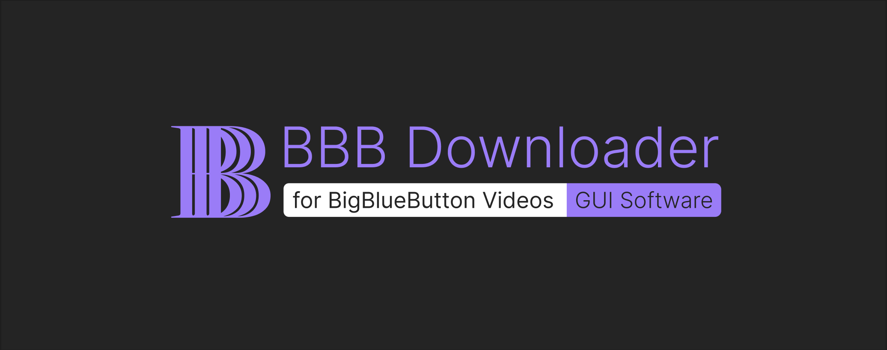
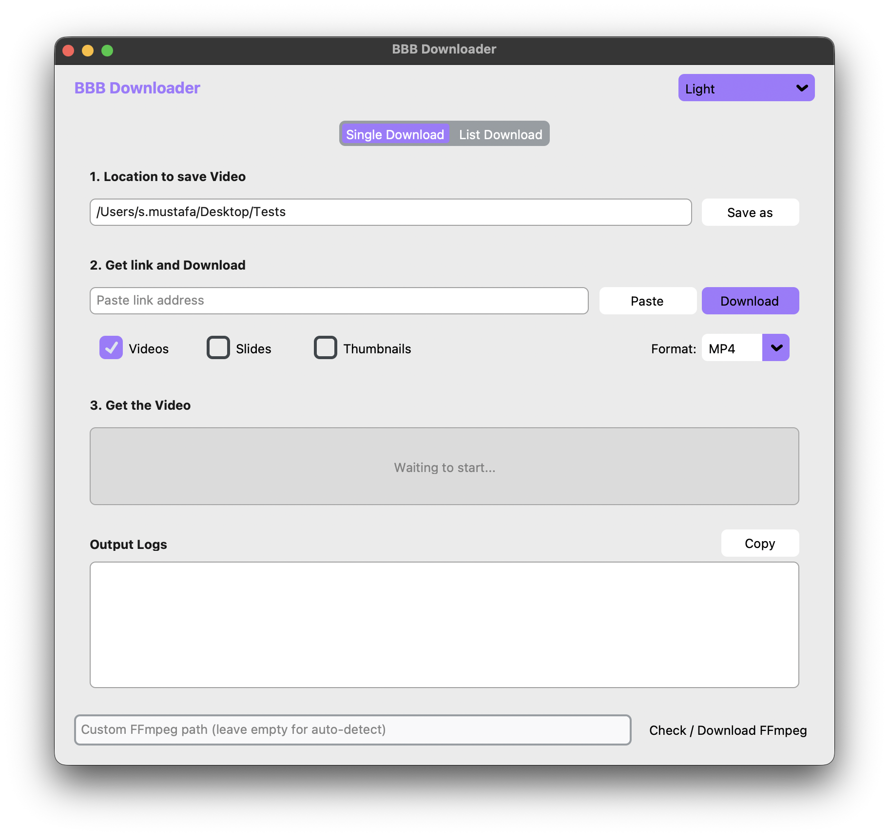
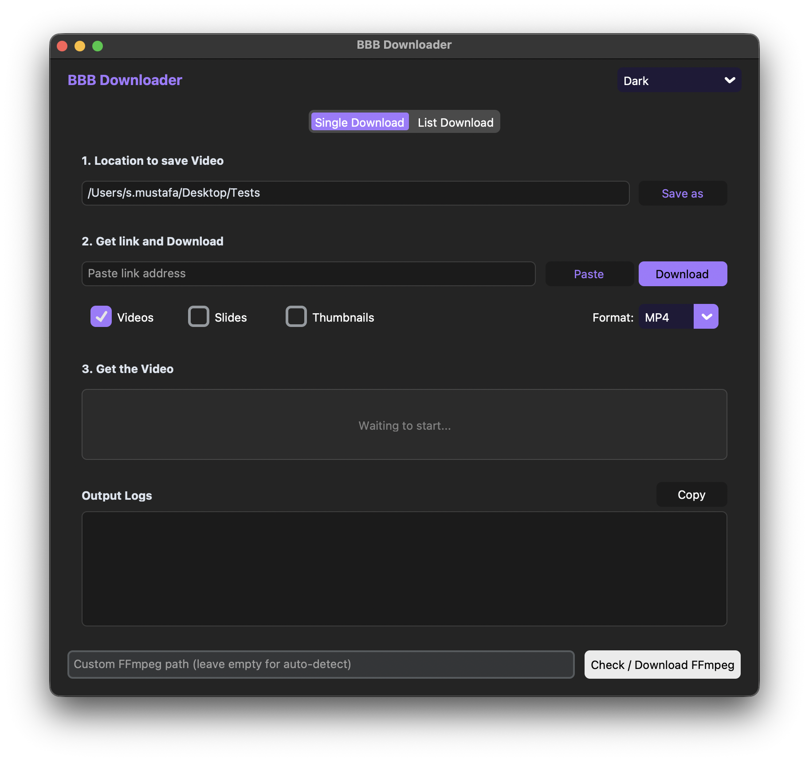

# BBB Downloader GUI

A desktop GUI built with [CustomTkinter](https://github.com/TomSchimansky/CustomTkinter)
that wraps the [bbb-downloader](https://github.com/soulgalore/bbb-downloader) scripts,
so you can download and merge BBB recordings without
a terminal. It drives the same pipeline (`download_bbb_data.py` → `ffmpeg` mux), adds
a paste-from-clipboard button, remembers the last save folder, and exposes the merge
options (lossless `-c copy` vs. full re-encode for iOS, keep/drop raw files).

<p align="center">
  
</p>

### Screenshots

<p align="center">
  
  &nbsp;
  
</p>

> The app auto-detects light/dark mode and switches layout. Webcam-only
> recordings (no deskshare) are handled: the webcam video is used as the
> primary stream and its embedded audio track is preserved.

### Files added by the GUI

```
main.py              – entry point: `python main.py`
bbb_gui.py           – UI layer (themes, tabs, paste button, status label, layout)
bbb_core.py          – download thread, URL parsing, ffmpeg merge & cleanup
ffmpeg_tools.py      – ffmpeg detection / download helper / ffprobe wrapper
script/              – patched copy of the upstream CLI scripts (bbb.py adds
                       alternate path variants for BBB playback URLs)
gui-assets/
  ├── images/        – Banner.jpg, Light-Theme.png, Dark-Theme.png
  └── icons/         – icon.icns (macOS), Dark_logo.ico (Windows), Dark_logo.png
python-requirements.txt – now includes customtkinter, pillow, pyperclip (additive)
```

> `script/bbb.py` carries two extra URL‑pattern regexes (`_VALID_URL2`,
> `_VALID_URL3`) on top of upstream's `_VALID_URL`; no upstream
> behaviour was removed — purely additive.

### How to run

You **don't need a terminal every time** — just set things up once, then double‑click a script.

**Step 1 — get the files**

- **Zip download** (no terminal): click the green **Code** button at the top of this page → **Download ZIP**. Unzip anywhere you like (Desktop, Documents, …) — all the code lands in a single folder.
- **git clone** (terminal, for developers): `git clone https://github.com/XDMustafa/bbb-downloader-gui-standalone`

**Step 2 — install Python** (one‑time)

- Download Python 3.8+ from [python.org](https://www.python.org/downloads/). During install **tick "Add Python to PATH"** (the installer offers a checkbox).

**Step 3 — install the GUI libraries** (one command in Terminal/CMD)

Open a terminal inside the folder you just extracted:

- **Windows**: right‑click inside the folder, pick "Open in Terminal" or "Open PowerShell here". If not available, type `cmd` in the folder address bar and press Enter.
- **macOS**: right‑click the folder → "New Terminal at Folder", or `cd` into it.

Once in the folder, run:

```bash
pip install -r python-requirements.txt
```

That's one line. You only run it **once** — afterwards all dependencies carry over.

**Step 4 — launch the app**

Still in the same terminal, type:

```bash
python main.py
```

The window opens. Next time you can open the folder normally and **double‑click `main.py`** (your system will use the Python you installed).

> **FFmpeg**: if you already have `ffmpeg` in your PATH (macOS users with Homebrew typically do) the app picks it up automatically. **If not — no worry.** The app has a built‑in **Check / Download FFmpeg** button that fetches a working build for you; no manual download, no PATH tweaking needed.

---

### GUI features (compared to the earlier script‑only version)

The GUI wraps the same upstream pipeline (`download_bbb_data.py` → `ffmpeg` mux) so you never touch a command line:

- **Single Download tab** — paste one BBB URL and go. The app extracts the video, webcam and deskshare streams automatically.
- **List Download tab** — paste a batch of URLs (one per line) and let the app process them all in sequence.
- **Checkboxes for the streams you need** — webcam, deskshare and slides each have a toggle; turn off what you don't want and save disk space.
- **Format options**
  - Default `‑c copy` (fast, lossless, seconds)
  - Optional **Full Compatibility** re‑encode (libx264 + AAC) for iOS / older players
  - Optional **Keep raw files** that leaves the intermediate `.webm` downloads untouched for inspection

> **Note:** The PyInstaller‑based standalone `.app` / `.exe` workflow that appeared in earlier builds has been removed. On modern macOS the bundled `.app` rendered a black window due to a Cocoa/Tk initialization mismatch. Running directly from source with `python main.py` works perfectly and is the supported path for now.

---

### Roadmap

- Android companion for downloading on mobile
- Adobe Connect recording support
- Similar web‑conference platforms

---

Based on [bbb-downloader](https://github.com/soulgalore/bbb-downloader).
Built with [CustomTkinter](https://github.com/TomSchimansky/CustomTkinter) — modern Tk design with vibecoding.